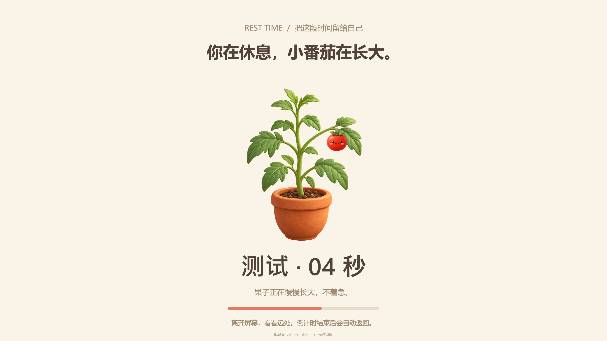

# 番茄小伴 · TomatoBuddy

[](https://github.com/lemon360/TomatoBuddy/actions/workflows/build.yml)
[](LICENSE)

Windows 11 x64 原生本地番茄时钟，WPF / .NET 8。奶油暖色界面、原创 AI 番茄插画与图标。

## 使用

从 [Releases](https://github.com/lemon360/TomatoBuddy/releases) 获取 Windows x64 便携包，解压后双击 `TomatoBuddy.exe`。便携版自带运行时，无需安装、联网或登录。也可在 Actions 中下载成功构建的产物。



- 专注默认 25 分钟，短休息 5 分钟，长休息 15 分钟，每 4 轮长休息。
- 可以暂停、继续、重置，填写本轮任务；只统计完成的专注轮次。
- 默认开启强制休息：全屏覆盖所有显示器，拦截普通关闭、Alt+Tab、Alt+F4、Windows 键等常用切屏操作，时间到自动解除。
- 设置中选择“番茄苗结果”或“番茄小人跳舞”，可预览 12 秒；强制模式会自动开始休息，不受自动休息开关影响。
- 完整完成一轮强制休息收获一颗果子，所有场景均计数；统计页面按日期展示收获，预览和紧急中止不计数。
- 应急解除：Ctrl+Alt+Shift+F12，本轮不结果。系统安全操作 Ctrl+Alt+Delete 和任务管理器保持可用。
- 声音、托盘通知和非强制模式下的普通提醒仍可使用。
- 关闭主窗口收进系统托盘；右键托盘菜单选择“退出”才会结束应用（强制休息期间不可退出）。
- 再次双击程序会唤回已运行的窗口。
- 统计包含今日收获、连续天数、近 7 天柱状图、最近 100 条记录及全部记录 CSV 导出。
- 设置和完成记录保存在 `%LOCALAPPDATA%/TomatoBuddy/data.json`。运行时不请求网络。

## 时间语义

计时使用 UTC 截止时间，最小化不影响计时。睡眠时间包含在当前阶段内；唤醒仅结算当前一轮，不补算多个虚构轮次。直接退出会放弃未完成计时。时长修改对下一轮生效，尚未开始的阶段会立即更新。连续天数允许今天尚未开始、昨天有记录的情况。

## 开发

需要 Windows 和 .NET 8 SDK：

```powershell
dotnet build TomatoBuddy.csproj -c Release
dotnet run --project Tests/Tests.csproj -c Release
dotnet publish TomatoBuddy.csproj -c Release -r win-x64 --self-contained true -p:PublishSingleFile=true -p:IncludeNativeLibrariesForSelfExtract=true -o release/win-x64
```

## 范围

参考网址为 https://huyanbao.cc，项目界面与素材为原创实现，未复制其界面或素材。实现专注与休息提醒，使用应用内全屏阻挡，不等同于 Windows 登录锁屏或不可绕过的安全边界；不修改系统安全策略，不阻止系统安全操作或任务管理器。终止进程、重启后不会继续强制休息，未完成休息不结果。不包含系统屏幕滤蓝光、自动开机启动或云同步。当前交付为未签名的 Windows x64 便携版。

AI 素材及生成提示词见 `docs/ai-assets.md`。测试记录见 `docs/verification.md`。


## 1.2 新增引导场景

在设置的“休息场景”中选择：

- 护眼远眺：10 秒准备、25 秒远眺、15 秒轻眨眼，然后自由休息。远眺是看向真实远处物体，不是看屏幕动画。
- 椅上轻活动：10 秒准备、20 秒轻柔肩部活动、20 秒脚踝活动，然后安静休息。选择稳固无轮椅子；仅在舒适范围内动作，不适时停做。
- 安静放松：舒适坐姿、放松肩膀、自然呼吸，不要求屏息或跟随图像呼吸。

三种场景均为分阶段文字引导和原创 AI 陪伴插画，没有动作识别或语音播报；不要求持续观看屏幕。完成休息照常收获果子，不校验是否做动作。预览会压缩引导流程用于查看效果，正式休息按真实秒数推进。通用休息建议不用于治疗眼病或运动损伤。

建议的依据与设计取舍见 docs/wellness-sources.md。

## 开源许可

代码采用 [MIT](LICENSE) 许可证；AI 素材及运行时说明见 [NOTICE.md](NOTICE.md)。欢迎提交 Issue 或 Pull Request，参见 [贡献指南](CONTRIBUTING.md)。
